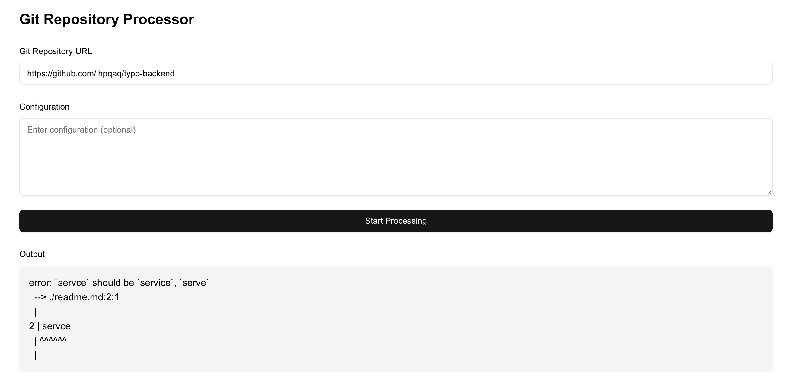

# git-typo

检查github仓库的typos，不要用来水PR哦😌  

## Qucikstart

#### backend

```shell
cd backend
go mod tiny
go run typo
```

### frontend

```shell
cd frontend
npm install
npm run dev
```

Then, open http://localhost:3000/  

